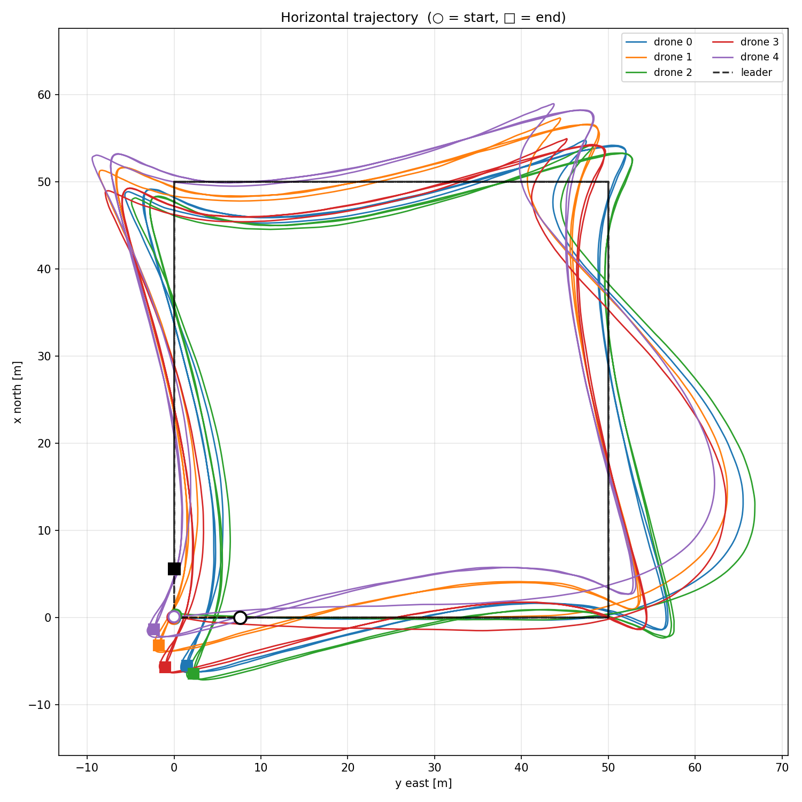
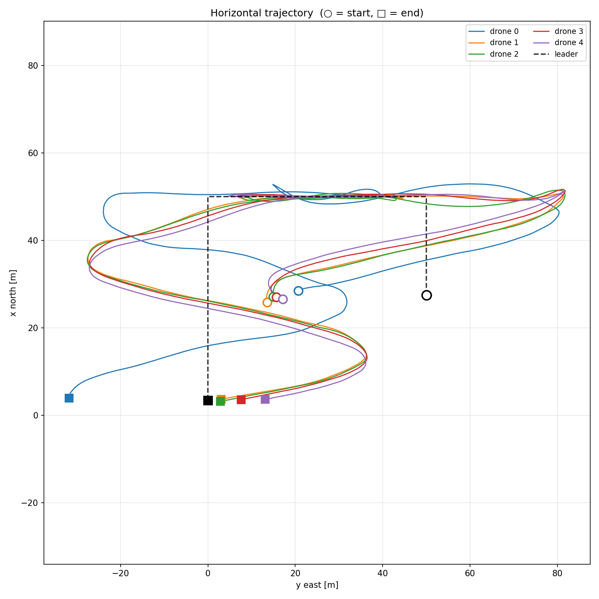

# ros2_multi_offboard_ws

A ROS 2 workspace containing three approaches to multi-vehicle offboard
control with [PX4-Autopilot], bridged through the [Micro XRCE-DDS]
uORB-to-DDS layer.

ROS 2 + PX4 swarm-control examples are surprisingly hard to find
collected in one place, so this repo records three different
implementations side-by-side: a small 2-drone circular loop, a 9-drone
MPC formation, and a 9-drone distributed flocking controller.

> **Note**
> This repository is primarily a **code showcase** documenting three
> control approaches and their patterns. It is **not** guaranteed to
> build / run as-is on every machine — paths, PX4 versions, and DDS
> middleware configuration will likely need adjusting. If you are
> looking for a ready-to-fly stack, this is not it; if you are looking
> for working ROS 2 + PX4 + uXRCE-DDS reference code to read, you are
> in the right place.

## Packages

### `multi_offboard_control/` — two-drone circular flight
A C++ baseline for controlling multiple PX4 instances over the
uXRCE-DDS bridge. Implements two drones flying coordinated circles.
Acknowledgement: the structure of this package follows the
[ROS2+PX4 multi-drone Offboard tutorial by J.Yao on Zhihu][zhihu-jyao],
which I found very helpful when first wiring up the topic namespaces
(`/fmu/...`, `/px4_2/fmu/...`, etc.).

### `mpc_control/` — nine-drone MPC formation
A Python MPC-based controller for nine drones flying a 50×50 m
rectangular pattern. Includes:
- a virtual-leader node generating the reference trajectory,
- an arming node handling mode switching and `arm` commands,
- a per-vehicle MPC node solving the local optimization (NumPy /
  SciPy), and
- a launch file that brings everything up together.

### `flocking_swarm/` — nine-drone distributed flocking
A distributed flocking controller for nine drones forming a 3×3 grid.
Each vehicle subscribes to its neighbours' odometry and computes a
flocking-style consensus update; there is no central planner. Same
helper-node structure as `mpc_control/` (virtual leader, arming,
launch).

## Repository Layout

    ros2_multi_offboard_ws/
    ├── src/
    │   ├── multi_offboard_control/   # C++,    2 drones, circular
    │   ├── mpc_control/              # Python, 9 drones, MPC
    │   └── flocking_swarm/           # Python, 9 drones, flocking
    ├── plot_flocking.py              # rosbag → matplotlib helper
    ├── record_flocking.sh            # rosbag recording helper
    ├── LICENSE
    └── README.md

Note: `px4_msgs` and `px4_ros_com` are **not vendored** here. They are
PX4 official packages and should be cloned separately into `src/`
(see Setup below).

## Prerequisites

| Component             | Tested version                              |
|-----------------------|---------------------------------------------|
| Ubuntu                | 22.04                                       |
| ROS 2                 | Humble                                      |
| PX4-Autopilot         | v1.14.3, with `uxrce_dds_client` enabled    |
| Micro XRCE-DDS Agent  | built from source (latest)                  |
| RMW implementation    | `rmw_cyclonedds_cpp`                        |
| Companion computer    | Raspberry Pi 4B (8 GB), Ubuntu 22.04        |
| Simulator             | Gazebo Garden (standalone mode)             |

## Setup

```bash
# 1. Workspace
mkdir -p ~/ros2_multi_offboard_ws
cd ~/ros2_multi_offboard_ws

# 2. Clone this repo (contents go directly into the workspace root)
git clone https://github.com/ShiruiPENG-CHERRY/ros2_multi_offboard_ws.git .

# 3. Clone PX4 message + bridge packages alongside
cd src
git clone -b release/1.14 https://github.com/PX4/px4_msgs.git
git clone https://github.com/PX4/px4_ros_com.git

# 4. Build
cd ..
source /opt/ros/humble/setup.bash
colcon build
source install/setup.bash
```

## Running (Simulation)

For the 9-drone packages (`mpc_control`, `flocking_swarm`):

```bash
# Terminal 1: start Gazebo
cd ~/PX4-Autopilot-1.14
gz sim -r -s Tools/simulation/gz/worlds/default.sdf

# Terminal 2: spawn 9 PX4 instances in a 3x3 formation
bash src/mpc_control/start_9_px4.sh
# (the same script lives in flocking_swarm/ and multi_offboard_control/)

# Terminal 3: DDS agent
MicroXRCEAgent udp4 -p 8888

# Terminal 4: launch the controller
ros2 launch mpc_control swarm_launch.py
# or:
ros2 launch flocking_swarm swarm_launch.py
```

## uXRCE-DDS Topic Naming Convention

When multiple PX4 instances connect to the same agent, each one's
topic prefix is derived from the `UXRCE_DDS_KEY` PX4 parameter set on
that vehicle:

| `UXRCE_DDS_KEY` | ROS 2 topic prefix             |
|-----------------|--------------------------------|
| 1 (or default)  | `/fmu/in/...` , `/fmu/out/...` |
| 2               | `/px4_2/fmu/in/...`            |
| N (N ≥ 2)       | `/px4_N/fmu/in/...`            |

So with nine drones, drone 0 publishes / subscribes under `/fmu/`
while drones 1–8 use `/px4_2/fmu/` ... `/px4_9/fmu/`. The launch
files in this repo follow that convention.

## Hardware Notes (real-flight, in progress)

The intended deployment target for these controllers is a Raspberry
Pi 4B companion computer talking to a Pixhawk 6C over TELEM2 (serial,
921600 baud). The on-board setup mirrors the simulation setup, with
`MicroXRCEAgent serial --dev /dev/ttyUSB0 -b 921600` replacing the
`udp4` agent. Real-flight bring-up is still in progress — the code in
this repo has been validated in SITL only.

## Results

Two stages of the experimental 5-drone controller, both run in PX4 SITL + Gazebo.
Same hardware/sim setup, same 5-drone cross topology — different controllers.

### Earlier stage: consensus controller

See [docs/results/consensus_5_drone/](docs/results/consensus_5_drone/).



### Later stage: acados-MPC controller

See [docs/results/mpc_5_drone_hover/](docs/results/mpc_5_drone_hover/).



## License

MIT — see [LICENSE](LICENSE).

## Acknowledgements

- [J.Yao's "ROS2 + PX4 multi-UAV swarm" Zhihu series][zhihu-jyao] —
  guided the initial wiring of `multi_offboard_control` and the
  general topic-namespace conventions used throughout.
- The PX4 team for shipping `uxrce_dds_client` in the default firmware
  and maintaining `px4_msgs` / `px4_ros_com`.
- eProsima for the [Micro XRCE-DDS Agent][mxrce].

[PX4-Autopilot]: https://github.com/PX4/PX4-Autopilot
[Micro XRCE-DDS]: https://docs.px4.io/v1.14/en/middleware/uxrce_dds.html
[mxrce]: https://github.com/eProsima/Micro-XRCE-DDS-Agent
[zhihu-jyao]: https://zhuanlan.zhihu.com/p/1904187016243045984
